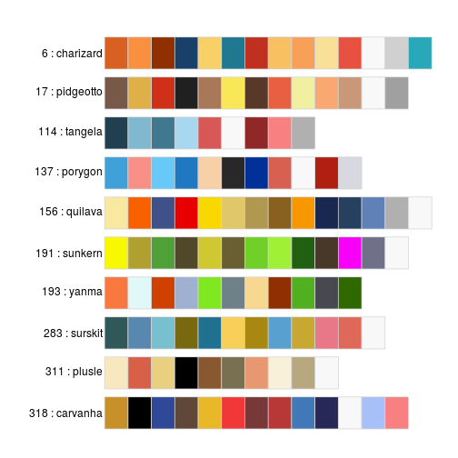
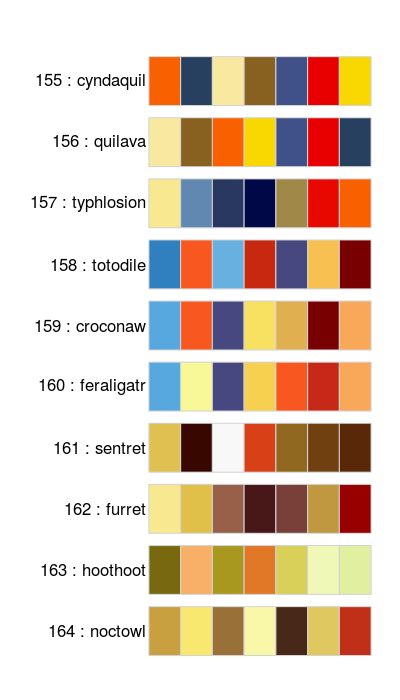
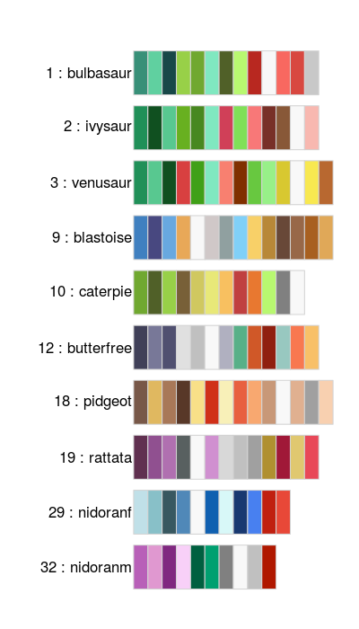
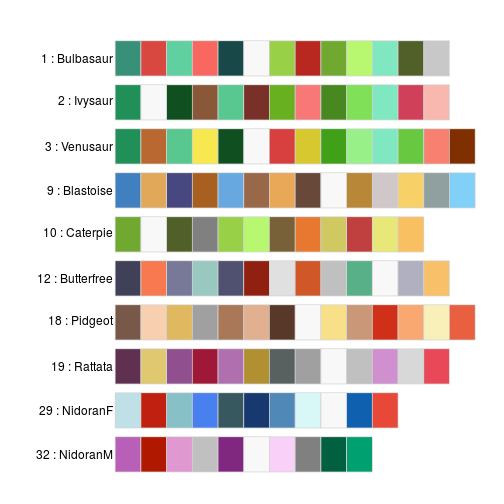
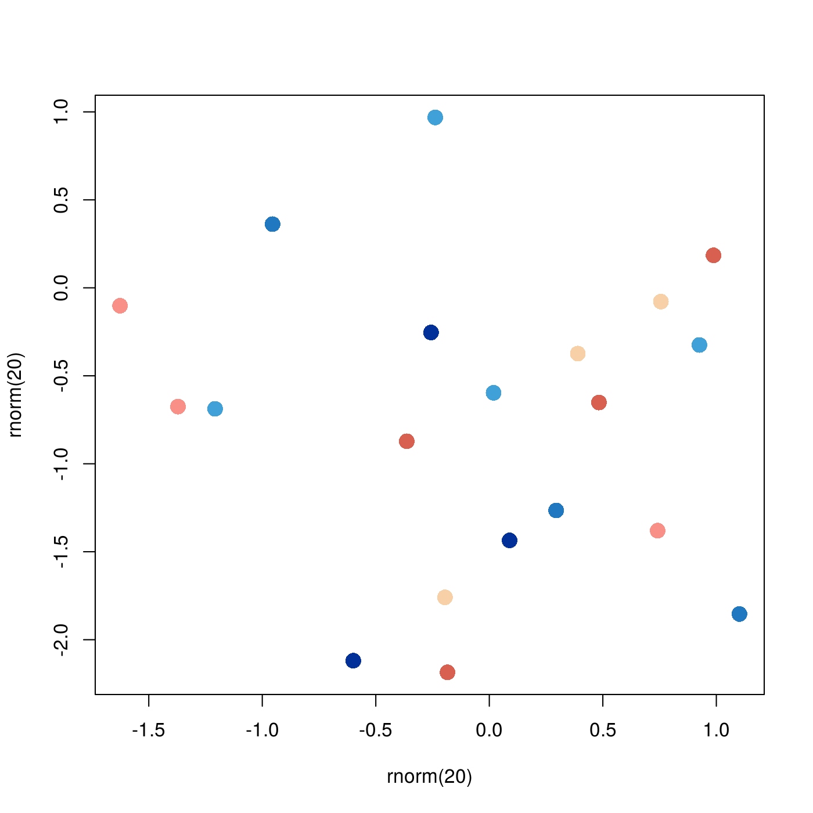
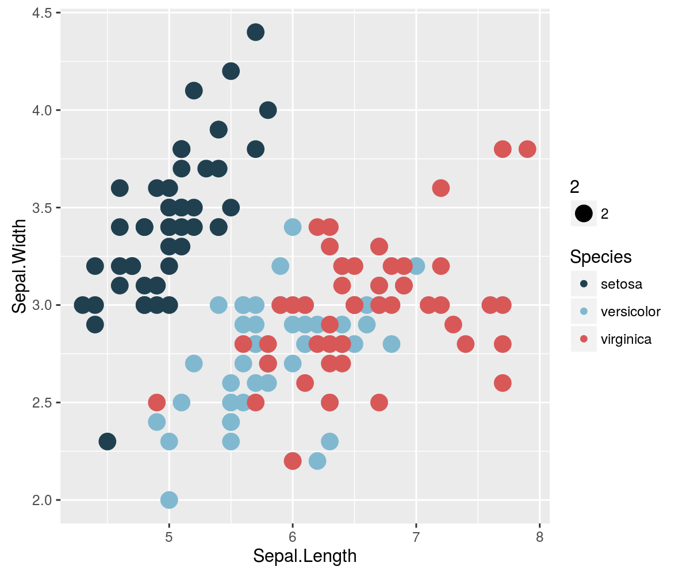
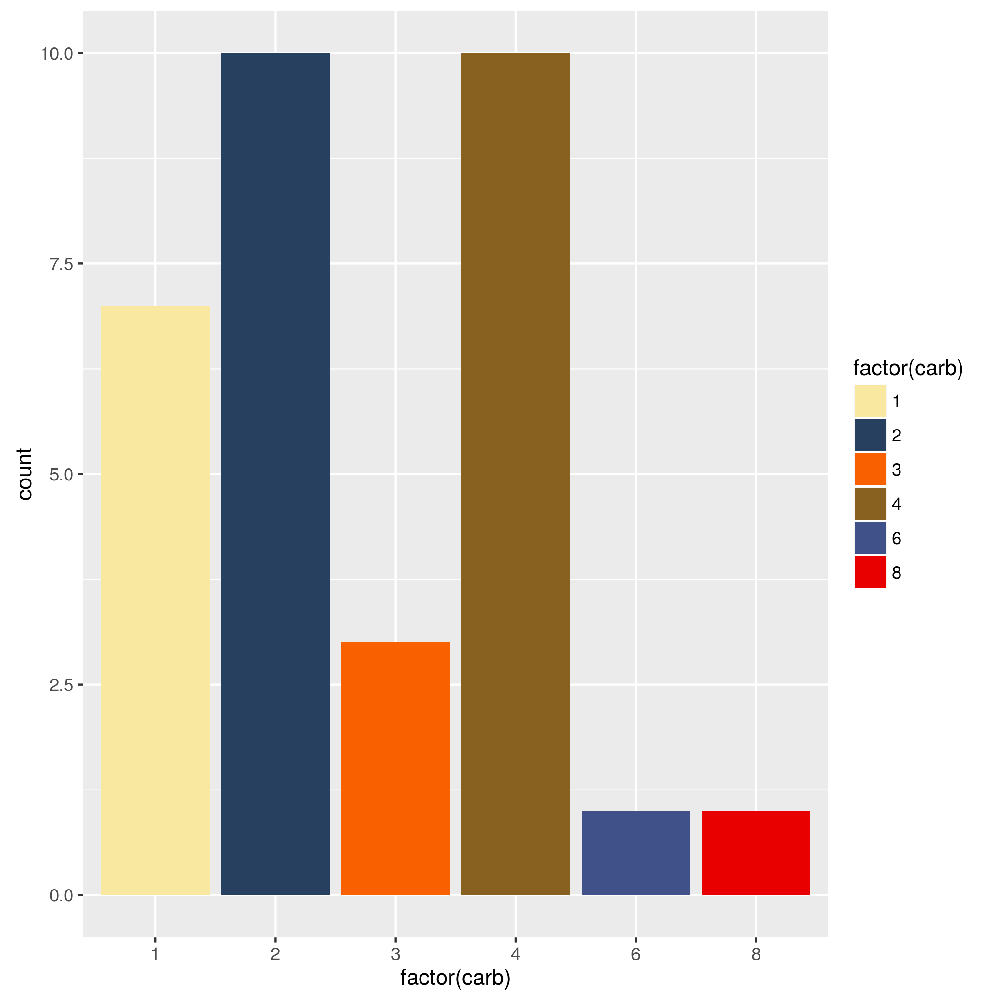

palettetown
======

[](http://cranlogs.r-pkg.org/badges/grand-total/palettetown/index.html)
[](https://travis-ci.org/timcdlucas/palettetown)

An R package providing pokemon colour palettes.

This package is very much inspired by [pokepalettes](http://pokepalettes.com/#charizard).

Note that Pokemon, pokedex and all pokemon names are trademarks of Nintendo. I own nothing.


Installation
-------------

### To install from CRAN

```r
install.packages('palettetown')
library(palettetown)
```

### To install development version

```r
library(devtools)
install_github('timcdlucas/palettetown')
library(palettetown)
```

Usage
------

### See palettes


```r
# Show ten of the better palettes
pokedex()
```



```r
# Show ten palettes starting from pokemon #155
# Get 7 fairly distinct colours for each.
pokedex(155, 7)
```



```r
# Show ten palettes starting from Metapod
pokedex('Metapod')
```



```r
# Show ten palettes that are fairly colour blind friendly
pokedex(cb = 1)
```




### Base graphics


```r
plot(rnorm(20), rnorm(20), col = pokepal(pokemon = 137, spread = 6), pch = 16, cex = 1.8)
```



### ggplot2

```r
# palettetown doesn't import ggplot2
library(ggplot2)


qplot(Sepal.Length, Sepal.Width, colour = Species, data=iris, size = 2) +
  scale_colour_poke(pokemon = 156, spread = 3)
```



```r
qplot(factor(carb), data=mtcars, geom="bar", 
  fill = factor(carb)) +
  scale_fill_poke(pokemon = 'Quilava', spread = 6)
```




